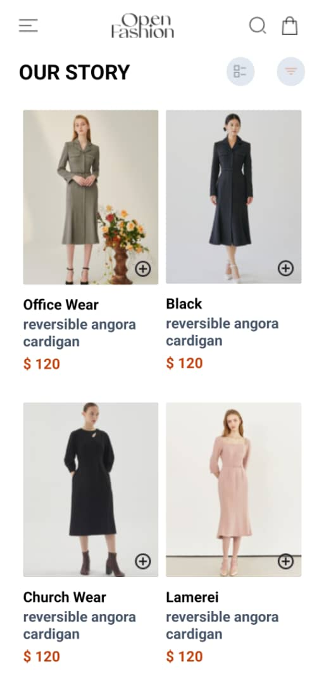

# rn-assignment6-11028723

## Description

This application allows users to view a list of available products, add products to their cart, and manage their selected items efficiently. Users can store their selected items locally on the device using AsyncStorage. The app includes a HomeScreen to display products and a CartScreen to manage the items in the cart.

### Components

#### `HomeScreen`

- Displays a list of available products.
- Each product includes an "Add to cart" button.

#### `CartScreen`

- Displays the selected items in the cart.
- Each item includes a "Remove from cart" button.

### Functionality

- Users can view a list of available products.
- Users can add products to their cart.
- Users can remove products from their cart.
- Users can view the items in their cart.

## Student ID

11028723

## Screenshot



<!--  -->

## Instructions to Run the Project

1. Clone the repository:

   ```bash
   git clone https://github.com/KelvinLinnaeus/rn-assignment6-11028723.git
   cd rn-assignment6-11028723
   ```

2. Install the dependencies:

   ```bash
   npm install
   ```

3. Start the development server:

   ```bash
   npm run start
   ```

4. Run the app on an emulator or physical device:

   ```bash
   press a # For Android
   press i # For iOS
   scan the QR Code generated to run on a physical device
   ```
